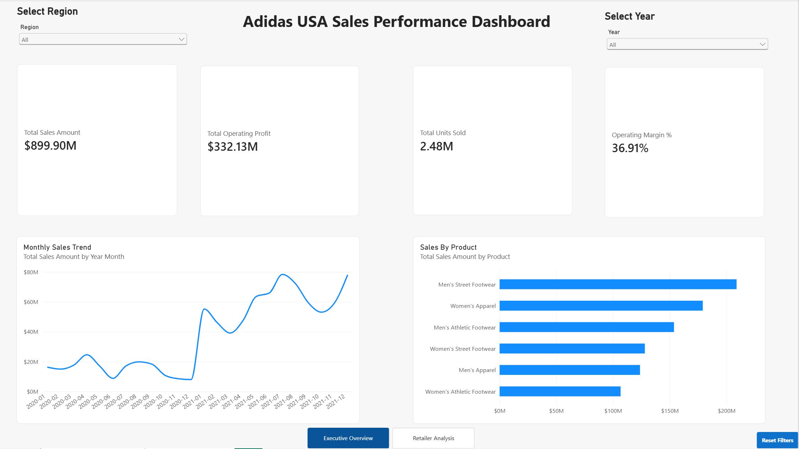
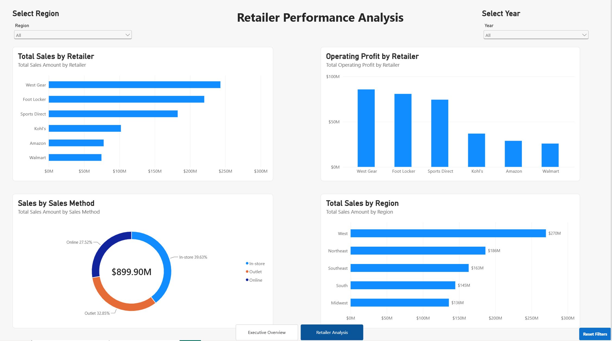

# Adidas USA Sales Performance Analysis

## Project Status

In progress

## Project Overview

This portfolio project uses a publicly available Adidas USA sales sample dataset to analyze sales, operating profit, product performance, retailer performance, regional trends, and sales channels during 2020 and 2021.

The project demonstrates data cleaning, data-quality validation, SQL analysis, dimensional modeling, Power BI dashboard development, DAX measures, and business recommendations.


## Business Objectives

- Evaluate total sales, units sold, operating profit, and operating margin.
- Identify high-performing and underperforming products.
- Compare retailer performance.
- Analyze sales and profitability across regions, states, and cities.
- Compare in-store, online, and outlet sales methods.
- Identify monthly and yearly performance trends.
- Detect data-quality issues and reconcile financial calculations.
- Recommend actions to improve sales and operating performance.

## Tools

- Excel
- SQL
- Power BI
- DAX
- Power Query
- Git and GitHub

## Planned Data Model

- `fact_sales`
- `dim_date`
- `dim_product`
- `dim_retailer`
- `dim_location`

## Project Structure

```text
data/
  raw/
  processed/
sql/
powerbi/
docs/
images/

## Dashboard Preview

### Executive Overview



### Retailer Analysis


